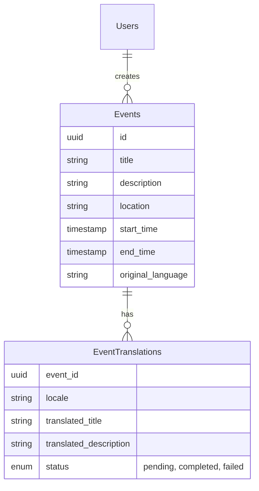

# Poly Event 🌍

[](https://poly-event.vercel.app)
[](https://lingo.dev)
[](https://supabase.com)
[](https://nextjs.org)

**Poly Event** is a next-generation multilingual event management platform built for the **Lingo.dev Hackathon**. It aims to break down language barriers in community organizing by automatically translating event details into 11+ languages instantly, powered by Lingo.dev's advanced AI translation engine.

## 🚀 Key Features

### 🌐 Global Event Management

- **Instant Translation**: Events created in any supported language are automatically translated into 11+ global languages (English, Spanish, French, German, Hindi, Japanese, etc.).
- **Lazy Loading Strategy**: Translations are generated on-demand or via background workers to optimize cost and performance.
- **Context-Aware**: Uses `lingo.localizeObject` to ensure event titles and descriptions maintain their context and tone across languages.

### ⚡ Modern User Experience

- **Zero-Latency UI**: All static interface text is pre-translated at build time using the **Lingo.dev CLI**, ensuring instantaneous page loads.
- **Interactive UI**: Built with **React 19** and **Tailwind CSS v4** for a fluid, responsive, and accessible experience.
- **Premium Components**: Utilizes **Shadcn UI** for a consistent and professional design system.

### 🔐 Secure & Scalable

- **Passwordless Auth**: Secure email-based OTP login via **Supabase Auth**.
- **Robust Validation**: Server-side validation with **Zod** for all inputs, ensuring data integrity.
- **Type Safety**: End-to-end type safety with TypeScript, from the database to the frontend.

---

## 🛠️ The Lingo.dev Integration

This project is a showcase of the full **Lingo.dev Ecosystem**, demonstrating how to combine static and dynamic translation strategies effectively.

### 1. Static Content (CLI)

We handle the application shell (navigation, buttons, labels) using the Lingo.dev CLI. This ensures that the core UI is always translated and available immediately.

- **Workflow**:
  - Developers write text in `i18n/en.json`.
  - GitHub Actions (`.github/workflows/translate.yml`) triggers `lingo.dev translate` on push.
  - Lingo.dev generates `es.json`, `fr.json`, etc., which are committed back to the repo.

### 2. Dynamic Content (SDK)

User-generated content (Events) is unpredictable and must be translated at runtime. We use the `@lingo.dev/sdk` for this.

- **Implementation**:
  - **Translation Guards**: We check if content _needs_ translation before calling the API to save costs.
  - **Background Workers**: Heavy translations are offloaded to background tasks to keep the UI snappy.
  - **Code Example**:
    ```typescript
    // src/features/events/event.worker.ts
    const translated = await lingo.localizeObject(
      { title: event.title, description: event.description },
      { sourceLocale, targetLocale },
    );
    ```

---

## 🏗️ Architecture & Tech Stack

### Frontend

- **Framework**: Next.js 16 (App Router)
- **Language**: TypeScript
- **Styling**: Tailwind CSS v4, Lucide React (Icons)
- **UI Library**: Shadcn UI (Radix Primitives)
- **State Management**: React Query (TanStack Query)

### Backend

- **Database**: PostgreSQL (via Supabase)
- **Authentication**: Supabase Auth (Magic Link / OTP)
- **Server Actions**: Next.js Server Actions for mutations

### DevOps

- **Hosting**: Vercel
- **CI/CD**: GitHub Actions (Linting, Translation Sync)
- **Package Manager**: pnpm

---

## 💾 Database Schema

The core data model revolves around `events` and their `event_translations`.



---

## 🏃‍♂️ Local Development

### Prerequisites

- Node.js 18+
- pnpm (recommended)
- A generic Supabase project
- A Lingo.dev API Key

### Setup Instructions

1.  **Clone the Repository**

    ```bash
    git clone https://github.com/your-username/poly-event.git
    cd poly-event
    ```

2.  **Install Dependencies**

    ```bash
    pnpm install
    ```

3.  **Environment Configuration**
    Create a `.env.local` file in the root:

    ```bash
    # Supabase (Get from Project Settings -> API)
    NEXT_PUBLIC_SUPABASE_URL="https://your-project.supabase.co"
    NEXT_PUBLIC_SUPABASE_ANON_KEY="your-anon-key"

    # Lingo.dev (Get from Dashboard)
    LINGODOTDEV_API_KEY="your-lingo-api-key"
    ```

4.  **Run Development Server**
    ```bash
    pnpm dev
    ```
    Visit `http://localhost:3000` to see the app.

---

## 📄 License

This project is open-source and available under the [MIT License](LICENSE).

Built with ❤️ for the Lingo.dev Hackathon.
